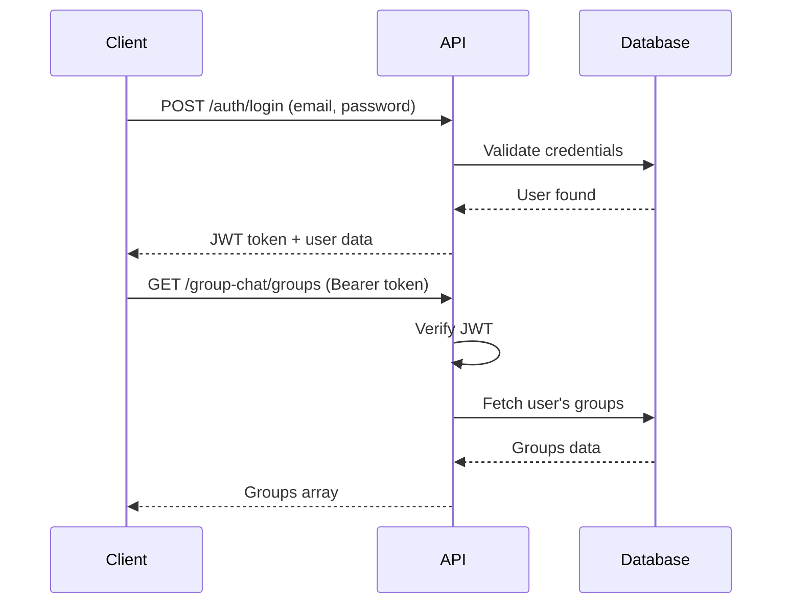

# Group Chat API Reference

Complete API documentation for the PulseLink Group Chat feature covering REST endpoints, WebSocket events, and data models.

---

## 📡 REST API Endpoints

### Base URL

```
Production: https://api.pulsetek.co.za/api/v1
Development: http://localhost:3000/api/v1
```

### Authentication

All endpoints require JWT authentication via Bearer token:

```http
Authorization: Bearer <your-access-token>
```

---

## Group Management Endpoints

### Create Group

**Endpoint**: `POST /group-chat/groups`

**Description**: Create a new group conversation

**Request Body**:
```json
{
  "title": "My Group",
  "description": "Group description",
  "groupType": "standard",
  "participantUserIds": ["user1-id", "user2-id"],
  "maxParticipants": 50,
  "allowParticipantInvite": true,
  "requireApproval": false,
  "autoAcceptFriends": true,
  "enableVoiceChat": true,
  "enableVideoChat": false
}
```

**Response** (200 OK):
```json
{
  "id": "group-id",
  "title": "My Group",
  "description": "Group description",
  "avatar": null,
  "groupType": "standard",
  "createdAt": "2024-12-20T10:00:00Z",
  "updatedAt": "2024-12-20T10:00:00Z",
  "participants": [
    {
      "id": "participant-id",
      "userId": "user1-id",
      "name": "John Doe",
      "avatar": "https://...",
      "role": "owner",
      "joinedAt": "2024-12-20T10:00:00Z",
      "lastActive": null,
      "isMuted": false,
      "isBanned": false
    }
  ],
  "settings": {
    "id": "settings-id",
    "groupType": "standard",
    "maxParticipants": 50,
    "allowParticipantInvite": true,
    "requireApproval": false,
    "autoAcceptFriends": true,
    "enableVoiceChat": true,
    "enableVideoChat": false
  },
  "unreadCount": 0
}
```

**Validation Rules**:
- `title`: Required, 1-50 characters
- `groupType`: Must be one of: `standard`, `study`, `interest`, `dating`, `liveHost`, `speedDating`
- `participantUserIds`: Required, at least 1 user, all users must exist
- `maxParticipants`: 10-500

**Error Responses**:
```json
// 400 Bad Request - Validation failure
{
  "statusCode": 400,
  "message": ["title must be between 1 and 50 characters"],
  "error": "Bad Request"
}

// 404 Not Found - User doesn't exist
{
  "statusCode": 404,
  "message": "User with ID user1-id not found",
  "error": "Not Found"
}

// 401 Unauthorized - No/invalid token
{
  "statusCode": 401,
  "message": "Unauthorized",
  "error": "Unauthorized"
}
```

---

### Get Group Details

**Endpoint**: `GET /group-chat/groups/:groupId`

**Description**: Get detailed information about a group

**Path Parameters**:
- `groupId` (string, required): The group ID

**Response** (200 OK):
```json
{
  "id": "group-id",
  "title": "My Group",
  "description": "Group description",
  "avatar": "https://...",
  "groupType": "standard",
  "createdAt": "2024-12-20T10:00:00Z",
  "updatedAt": "2024-12-20T10:00:00Z",
  "participants": [
    {
      "id": "participant-id",
      "userId": "user1-id",
      "name": "John Doe",
      "avatar": "https://...",
      "role": "owner",
      "joinedAt": "2024-12-20T10:00:00Z",
      "lastActive": "2024-12-20T11:30:00Z",
      "isMuted": false,
      "isBanned": false
    }
  ],
  "settings": {
    "id": "settings-id",
    "groupType": "standard",
    "maxParticipants": 50,
    "allowParticipantInvite": true,
    "requireApproval": false,
    "autoAcceptFriends": true,
    "enableVoiceChat": true,
    "enableVideoChat": false
  },
  "unreadCount": 5
}
```

**Error Responses**:
```json
// 404 Not Found
{
  "statusCode": 404,
  "message": "Group not found",
  "error": "Not Found"
}

// 403 Forbidden - Not a participant
{
  "statusCode": 403,
  "message": "You are not a member of this group",
  "error": "Forbidden"
}
```

---

### Update Group Settings

**Endpoint**: `PATCH /group-chat/groups/:groupId/settings`

**Description**: Update group settings (admins only)

**Path Parameters**:
- `groupId` (string, required): The group ID

**Request Body** (all fields optional):
```json
{
  "title": "Updated Group Name",
  "description": "Updated description",
  "maxParticipants": 100,
  "allowParticipantInvite": false,
  "requireApproval": true,
  "enableVoiceChat": true,
  "enableVideoChat": true
}
```

**Response** (200 OK):
```json
{
  "id": "settings-id",
  "groupType": "standard",
  "maxParticipants": 100,
  "allowParticipantInvite": false,
  "requireApproval": true,
  "autoAcceptFriends": true,
  "enableVoiceChat": true,
  "enableVideoChat": true
}
```

**Error Responses**:
```json
// 403 Forbidden - Not an admin
{
  "statusCode": 403,
  "message": "Only group admins can update settings",
  "error": "Forbidden"
}
```

---

### Delete Group

**Endpoint**: `DELETE /group-chat/groups/:groupId`

**Description**: Delete a group (owner only)

**Path Parameters**:
- `groupId` (string, required): The group ID

**Response** (200 OK):
```json
{
  "message": "Group deleted successfully"
}
```

**Error Responses**:
```json
// 403 Forbidden - Not the owner
{
  "statusCode": 403,
  "message": "Only the group owner can delete the group",
  "error": "Forbidden"
}
```

---

## Participant Management Endpoints

### Add Participant

**Endpoint**: `POST /group-chat/groups/:groupId/participants`

**Description**: Add a user to the group

**Path Parameters**:
- `groupId` (string, required): The group ID

**Request Body**:
```json
{
  "userId": "user-id-to-add"
}
```

**Response** (200 OK):
```json
{
  "message": "Participant added successfully",
  "participant": {
    "id": "participant-id",
    "userId": "user-id-to-add",
    "name": "Jane Smith",
    "avatar": "https://...",
    "role": "member",
    "joinedAt": "2024-12-20T12:00:00Z",
    "lastActive": null,
    "isMuted": false,
    "isBanned": false
  }
}
```

**Error Responses**:
```json
// 400 Bad Request - Already a member
{
  "statusCode": 400,
  "message": "User is already a participant",
  "error": "Bad Request"
}

// 400 Bad Request - Group full
{
  "statusCode": 400,
  "message": "Group is full (50/50 participants)",
  "error": "Bad Request"
}

// 403 Forbidden - No permission
{
  "statusCode": 403,
  "message": "You do not have permission to add participants",
  "error": "Forbidden"
}
```

---

### Remove Participant

**Endpoint**: `DELETE /group-chat/groups/:groupId/participants/:userId`

**Description**: Remove a participant from the group (admins/moderators only)

**Path Parameters**:
- `groupId` (string, required): The group ID
- `userId` (string, required): The user ID to remove

**Response** (200 OK):
```json
{
  "message": "Participant removed successfully"
}
```

**Error Responses**:
```json
// 403 Forbidden - Cannot remove owner
{
  "statusCode": 403,
  "message": "Cannot remove the group owner",
  "error": "Forbidden"
}

// 403 Forbidden - No permission
{
  "statusCode": 403,
  "message": "You do not have permission to remove participants",
  "error": "Forbidden"
}
```

---

### Update Participant Role

**Endpoint**: `PATCH /group-chat/groups/:groupId/participants/:userId/role`

**Description**: Change a participant's role (owner/admin only)

**Path Parameters**:
- `groupId` (string, required): The group ID
- `userId` (string, required): The user ID

**Request Body**:
```json
{
  "role": "admin"
}
```

**Valid Roles**: `owner`, `admin`, `moderator`, `member`, `guest`

**Response** (200 OK):
```json
{
  "message": "Participant role updated successfully",
  "participant": {
    "id": "participant-id",
    "userId": "user-id",
    "name": "Jane Smith",
    "avatar": "https://...",
    "role": "admin",
    "joinedAt": "2024-12-20T10:00:00Z",
    "lastActive": "2024-12-20T12:00:00Z",
    "isMuted": false,
    "isBanned": false
  }
}
```

---

## Live Session Endpoints

### Create Live Session

**Endpoint**: `POST /group-chat/live-sessions`

**Description**: Create a new live session (Monkey.app style)

**Request Body**:
```json
{
  "conversationId": "group-id",
  "title": "Friday Night Hangout",
  "description": "Let's chat and have fun!",
  "maxParticipants": 20,
  "requireApproval": true
}
```

**Response** (201 Created):
```json
{
  "id": "session-id",
  "conversationId": "group-id",
  "hostId": "user-id",
  "hostName": "John Doe",
  "hostAvatar": "https://...",
  "title": "Friday Night Hangout",
  "description": "Let's chat and have fun!",
  "status": "waiting",
  "createdAt": "2024-12-20T20:00:00Z",
  "startedAt": null,
  "endedAt": null,
  "maxParticipants": 20,
  "currentParticipants": 0,
  "requireApproval": true
}
```

**Validation Rules**:
- `conversationId`: Required, must be a valid group ID
- `title`: Required, 1-100 characters
- `maxParticipants`: Optional, 2-500 (defaults to group's maxParticipants)
- `requireApproval`: Optional boolean (default: true)

---

### Get Active Live Sessions

**Endpoint**: `GET /group-chat/live-sessions/active`

**Description**: Get all currently active live sessions

**Query Parameters**:
- `groupType` (string, optional): Filter by group type

**Response** (200 OK):
```json
[
  {
    "id": "session-id-1",
    "conversationId": "group-id-1",
    "hostId": "user-id-1",
    "hostName": "John Doe",
    "hostAvatar": "https://...",
    "title": "Friday Night Hangout",
    "description": "Let's chat!",
    "status": "active",
    "createdAt": "2024-12-20T20:00:00Z",
    "startedAt": "2024-12-20T20:05:00Z",
    "endedAt": null,
    "maxParticipants": 20,
    "currentParticipants": 8,
    "requireApproval": true
  },
  {
    "id": "session-id-2",
    "conversationId": "group-id-2",
    "hostId": "user-id-2",
    "hostName": "Jane Smith",
    "hostAvatar": "https://...",
    "title": "Study Group",
    "description": null,
    "status": "active",
    "createdAt": "2024-12-20T19:00:00Z",
    "startedAt": "2024-12-20T19:00:00Z",
    "endedAt": null,
    "maxParticipants": 10,
    "currentParticipants": 5,
    "requireApproval": false
  }
]
```

---

### Start Live Session

**Endpoint**: `POST /group-chat/live-sessions/:sessionId/start`

**Description**: Start a live session (host only)

**Path Parameters**:
- `sessionId` (string, required): The session ID

**Response** (200 OK):
```json
{
  "id": "session-id",
  "conversationId": "group-id",
  "hostId": "user-id",
  "hostName": "John Doe",
  "hostAvatar": "https://...",
  "title": "Friday Night Hangout",
  "description": "Let's chat and have fun!",
  "status": "active",
  "createdAt": "2024-12-20T20:00:00Z",
  "startedAt": "2024-12-20T20:05:00Z",
  "endedAt": null,
  "maxParticipants": 20,
  "currentParticipants": 1,
  "requireApproval": true
}
```

**Error Responses**:
```json
// 403 Forbidden - Not the host
{
  "statusCode": 403,
  "message": "Only the host can start the session",
  "error": "Forbidden"
}

// 400 Bad Request - Already started
{
  "statusCode": 400,
  "message": "Session has already started",
  "error": "Bad Request"
}
```

---

### End Live Session

**Endpoint**: `POST /group-chat/live-sessions/:sessionId/end`

**Description**: End a live session (host only)

**Path Parameters**:
- `sessionId` (string, required): The session ID

**Response** (200 OK):
```json
{
  "id": "session-id",
  "conversationId": "group-id",
  "hostId": "user-id",
  "hostName": "John Doe",
  "hostAvatar": "https://...",
  "title": "Friday Night Hangout",
  "description": "Let's chat and have fun!",
  "status": "ended",
  "createdAt": "2024-12-20T20:00:00Z",
  "startedAt": "2024-12-20T20:05:00Z",
  "endedAt": "2024-12-20T22:00:00Z",
  "maxParticipants": 20,
  "currentParticipants": 0,
  "requireApproval": true
}
```

---

## Join Request Endpoints

### Request to Join Session

**Endpoint**: `POST /group-chat/live-sessions/:sessionId/join-requests`

**Description**: Request to join a live session

**Path Parameters**:
- `sessionId` (string, required): The session ID

**Response** (201 Created):
```json
{
  "id": "request-id",
  "sessionId": "session-id",
  "userId": "user-id",
  "userName": "Jane Smith",
  "userAvatar": "https://...",
  "status": "pending",
  "createdAt": "2024-12-20T20:10:00Z",
  "respondedAt": null,
  "respondedBy": null
}
```

**Error Responses**:
```json
// 400 Bad Request - Session full
{
  "statusCode": 400,
  "message": "Session is full (20/20 participants)",
  "error": "Bad Request"
}

// 400 Bad Request - Already joined
{
  "statusCode": 400,
  "message": "You have already joined this session",
  "error": "Bad Request"
}

// 400 Bad Request - Session ended
{
  "statusCode": 400,
  "message": "Session has ended",
  "error": "Bad Request"
}
```

---

### Get Pending Join Requests

**Endpoint**: `GET /group-chat/live-sessions/:sessionId/join-requests/pending`

**Description**: Get all pending join requests for a session (host only)

**Path Parameters**:
- `sessionId` (string, required): The session ID

**Response** (200 OK):
```json
[
  {
    "id": "request-id-1",
    "sessionId": "session-id",
    "userId": "user-id-1",
    "userName": "Jane Smith",
    "userAvatar": "https://...",
    "status": "pending",
    "createdAt": "2024-12-20T20:10:00Z",
    "respondedAt": null,
    "respondedBy": null
  },
  {
    "id": "request-id-2",
    "sessionId": "session-id",
    "userId": "user-id-2",
    "userName": "Bob Johnson",
    "userAvatar": "https://...",
    "status": "pending",
    "createdAt": "2024-12-20T20:12:00Z",
    "respondedAt": null,
    "respondedBy": null
  }
]
```

---

### Approve Join Request

**Endpoint**: `POST /group-chat/join-requests/:requestId/approve`

**Description**: Approve a join request (host only)

**Path Parameters**:
- `requestId` (string, required): The join request ID

**Response** (200 OK):
```json
{
  "id": "request-id",
  "sessionId": "session-id",
  "userId": "user-id",
  "userName": "Jane Smith",
  "userAvatar": "https://...",
  "status": "approved",
  "createdAt": "2024-12-20T20:10:00Z",
  "respondedAt": "2024-12-20T20:11:00Z",
  "respondedBy": "host-user-id"
}
```

---

### Reject Join Request

**Endpoint**: `POST /group-chat/join-requests/:requestId/reject`

**Description**: Reject a join request (host only)

**Path Parameters**:
- `requestId` (string, required): The join request ID

**Response** (200 OK):
```json
{
  "id": "request-id",
  "sessionId": "session-id",
  "userId": "user-id",
  "userName": "Jane Smith",
  "userAvatar": "https://...",
  "status": "rejected",
  "createdAt": "2024-12-20T20:10:00Z",
  "respondedAt": "2024-12-20T20:11:00Z",
  "respondedBy": "host-user-id"
}
```

---

## Moderation Endpoints

### Report User

**Endpoint**: `POST /group-chat/groups/:groupId/report`

**Description**: Report a user in a group

**Path Parameters**:
- `groupId` (string, required): The group ID

**Request Body**:
```json
{
  "userId": "reported-user-id",
  "reason": "Inappropriate behavior"
}
```

**Response** (201 Created):
```json
{
  "message": "Report submitted successfully",
  "reportId": "report-id"
}
```

---

### Ban User

**Endpoint**: `POST /group-chat/groups/:groupId/participants/:userId/ban`

**Description**: Ban a user from the group (admins/moderators only)

**Path Parameters**:
- `groupId` (string, required): The group ID
- `userId` (string, required): The user ID to ban

**Response** (200 OK):
```json
{
  "message": "User banned successfully"
}
```

---

### Unban User

**Endpoint**: `POST /group-chat/groups/:groupId/participants/:userId/unban`

**Description**: Unban a user from the group (admins only)

**Path Parameters**:
- `groupId` (string, required): The group ID
- `userId` (string, required): The user ID to unban

**Response** (200 OK):
```json
{
  "message": "User unbanned successfully"
}
```

---

## 🔌 WebSocket Events

### Connection

**URL**: `wss://api.pulsetek.co.za` (production) or `ws://localhost:3000` (development)

**Authentication**:
```javascript
const socket = io('wss://api.pulsetek.co.za', {
  auth: {
    token: 'your-jwt-token'
  }
});
```

---

### Client → Server Events

#### Join Group Room

**Event**: `join_group`

**Payload**:
```json
{
  "groupId": "group-id"
}
```

**Description**: Join a group's WebSocket room to receive real-time updates

---

#### Leave Group Room

**Event**: `leave_group`

**Payload**:
```json
{
  "groupId": "group-id"
}
```

**Description**: Leave a group's WebSocket room

---

#### Send Typing Indicator

**Event**: `typing`

**Payload**:
```json
{
  "groupId": "group-id",
  "isTyping": true
}
```

**Description**: Notify other participants that you're typing

---

### Server → Client Events

#### Participant Joined

**Event**: `participant_joined`

**Payload**:
```json
{
  "groupId": "group-id",
  "participant": {
    "id": "participant-id",
    "userId": "user-id",
    "name": "John Doe",
    "avatar": "https://...",
    "role": "member",
    "joinedAt": "2024-12-20T10:00:00Z",
    "lastActive": null,
    "isMuted": false,
    "isBanned": false
  }
}
```

---

#### Participant Left

**Event**: `participant_left`

**Payload**:
```json
{
  "groupId": "group-id",
  "userId": "user-id"
}
```

---

#### Participant Removed

**Event**: `participant_removed`

**Payload**:
```json
{
  "groupId": "group-id",
  "userId": "removed-user-id",
  "removedBy": "admin-user-id"
}
```

---

#### Join Request Received

**Event**: `join_request_received`

**Payload**:
```json
{
  "sessionId": "session-id",
  "request": {
    "id": "request-id",
    "sessionId": "session-id",
    "userId": "user-id",
    "userName": "Jane Smith",
    "userAvatar": "https://...",
    "status": "pending",
    "createdAt": "2024-12-20T20:10:00Z",
    "respondedAt": null,
    "respondedBy": null
  }
}
```

**Description**: Sent to the host when someone requests to join their live session

---

#### Join Request Approved

**Event**: `join_request_approved`

**Payload**:
```json
{
  "requestId": "request-id",
  "sessionId": "session-id"
}
```

**Description**: Sent to the requester when their request is approved

---

#### Join Request Rejected

**Event**: `join_request_rejected`

**Payload**:
```json
{
  "requestId": "request-id",
  "sessionId": "session-id"
}
```

**Description**: Sent to the requester when their request is rejected

---

#### Live Session Started

**Event**: `live_session_started`

**Payload**:
```json
{
  "session": {
    "id": "session-id",
    "conversationId": "group-id",
    "hostId": "user-id",
    "hostName": "John Doe",
    "hostAvatar": "https://...",
    "title": "Friday Night Hangout",
    "description": "Let's chat and have fun!",
    "status": "active",
    "createdAt": "2024-12-20T20:00:00Z",
    "startedAt": "2024-12-20T20:05:00Z",
    "endedAt": null,
    "maxParticipants": 20,
    "currentParticipants": 1,
    "requireApproval": true
  }
}
```

---

#### Live Session Ended

**Event**: `live_session_ended`

**Payload**:
```json
{
  "sessionId": "session-id",
  "endedAt": "2024-12-20T22:00:00Z"
}
```

---

#### Group Settings Updated

**Event**: `group_settings_updated`

**Payload**:
```json
{
  "groupId": "group-id",
  "settings": {
    "id": "settings-id",
    "groupType": "standard",
    "maxParticipants": 100,
    "allowParticipantInvite": false,
    "requireApproval": true,
    "autoAcceptFriends": true,
    "enableVoiceChat": true,
    "enableVideoChat": true
  }
}
```

---

#### Typing Indicator

**Event**: `typing`

**Payload**:
```json
{
  "groupId": "group-id",
  "userId": "user-id",
  "userName": "John Doe",
  "isTyping": true
}
```

---

## 🛠️ Error Codes

| Status Code | Description | Common Causes |
|-------------|-------------|---------------|
| 400 | Bad Request | Invalid input, validation failure |
| 401 | Unauthorized | Missing or invalid JWT token |
| 403 | Forbidden | Insufficient permissions |
| 404 | Not Found | Resource doesn't exist |
| 409 | Conflict | Duplicate resource (e.g., already joined) |
| 429 | Too Many Requests | Rate limit exceeded |
| 500 | Internal Server Error | Server-side issue |

---

## 📝 Rate Limiting

**Default Limits**:
- 100 requests per minute per IP
- 500 requests per hour per user

**Headers**:
```http
X-RateLimit-Limit: 100
X-RateLimit-Remaining: 95
X-RateLimit-Reset: 1703091600
```

---

## 🔐 Authentication Flow



---

## 📊 Example Integration

### Flutter HTTP Service

```dart
class GroupChatService {
  final String baseUrl;
  final String? accessToken;

  Future<GroupConversation> createGroup({
    required String title,
    required GroupType groupType,
    required List<String> participantUserIds,
    // ... other parameters
  }) async {
    final response = await http.post(
      Uri.parse('$baseUrl/group-chat/groups'),
      headers: {
        'Content-Type': 'application/json',
        if (accessToken != null)
          'Authorization': 'Bearer $accessToken',
      },
      body: jsonEncode({
        'title': title,
        'groupType': groupType.name,
        'participantUserIds': participantUserIds,
        // ... other parameters
      }),
    );

    if (response.statusCode == 200 || response.statusCode == 201) {
      return GroupConversation.fromJson(
        jsonDecode(response.body),
      );
    } else {
      throw Exception(
        'Failed to create group: ${response.body}',
      );
    }
  }
}
```

### Flutter WebSocket Service

```dart
class GroupChatWebSocketService {
  IO.Socket? _socket;

  void connect(String url, String token) {
    _socket = IO.io(url, <String, dynamic>{
      'transports': ['websocket'],
      'autoConnect': false,
      'auth': {'token': token},
    });

    _socket!.connect();

    _socket!.on('participant_joined', (data) {
      final participant = GroupParticipant.fromJson(data['participant']);
      _onParticipantJoinedController.add(participant);
    });
  }

  void joinGroup(String groupId) {
    _socket?.emit('join_group', {'groupId': groupId});
  }
}
```

---

## 🧪 Testing with cURL

### Create Group

```bash
curl -X POST https://api.pulsetek.co.za/api/v1/group-chat/groups \
  -H "Content-Type: application/json" \
  -H "Authorization: Bearer YOUR_TOKEN" \
  -d '{
    "title": "Test Group",
    "groupType": "standard",
    "participantUserIds": ["user1-id"],
    "maxParticipants": 50
  }'
```

### Get Active Live Sessions

```bash
curl -X GET https://api.pulsetek.co.za/api/v1/group-chat/live-sessions/active \
  -H "Authorization: Bearer YOUR_TOKEN"
```

---

## 📚 Additional Resources

- [Main Implementation Guide](./GROUP_CHAT_IMPLEMENTATION_GUIDE.md)
- [Backend Repository](../backend/)
- [Postman Collection](../docs/futuristic-dating-app-complete.postman_collection.json)
- [API Specification](../docs/3%20API_Specification.yaml)

---

*Last Updated: December 20, 2024*  
*API Version: 1.0.0*  
*Documentation Complete*
